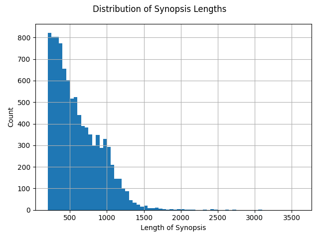
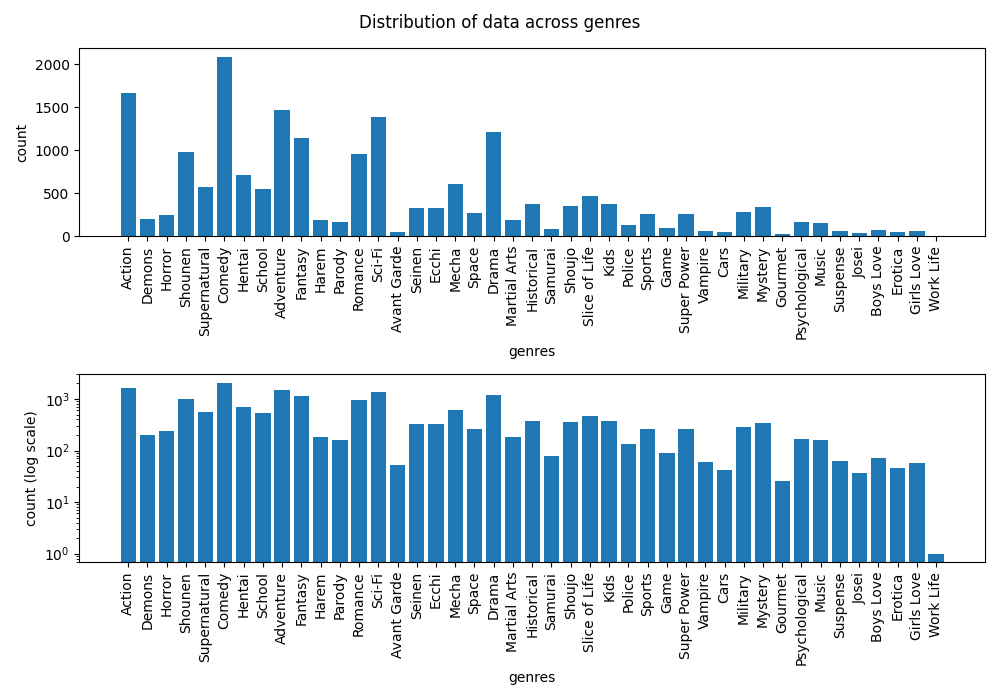
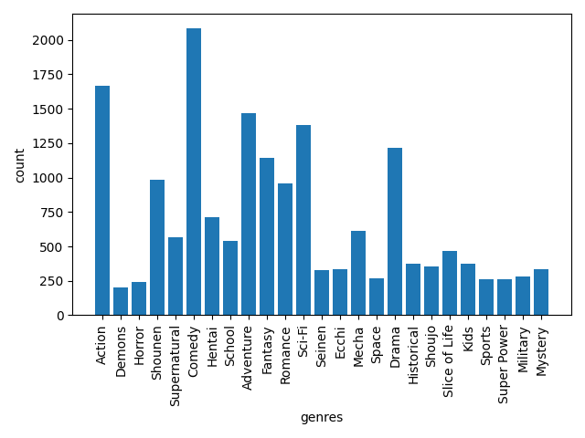
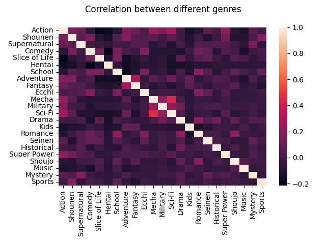

# Abstract

Anime refers to any hand-drawn or computer animation from Japan. In this project we try to predict genre of each anime based on their synopsis. We use an api from MyAnimeList, a popular online anime and manga community and database, to fetch the data. We compare the prediction accuracy of three models, namely Logistic Regression, Linear Support Vector Classifier, and Random Forests. 

# Introduction

Anime refers to any animation originating from Japan. While the Japanese people refer to all animations as anime (a shortened word for animation), the people outside Japan refer only to the animation originating from Japan as anime. In this project we will be looking at MyAnimeList database and try to predict the anime genre from their synopsis. We access this database by making API calls as described in the API documentation.[@myanimelist]

While MyAnimeList is similar IMDB, where people can rate anime, create watchlists, and write rewiews, it also allows users to create communities, discuss different animes and other shared interests. It also allows the user to do the same for Mangas, which are Japanese comics. The API can be used to collect data about animes and mangas, update user's watchlists, interact with the website's forum, and can also be integrated with other apps. The API can be used freely for academic purposes. The API uses tokens generated using OAuth for authentication.

While the API can be used query a variety of information about each anime, for the purpose of the project we will only be quering the following fields following fields:

* id: A unique identifier for each anime
* title: Name of the anime
* synopsis: A brief description of the anime
* genres: A list of genres the anime belongs to.

A complete list of fields and examples can be found in the API documentation.

The database assigns a unique integer id to each anime. We fetch the API responses for ids between 1 and 40000, and save the response as JSON files for the requests for the valid ids, with synopsis lengths of at least 200 characters. This leaves us with 9517 entries. The list of genres is listed and their explainations can be found at https://myanimelist.net/anime/genre/info. In our data, we have 43 genres in total. Figure 1 shows the distribution of synopsis lengths in our data.

*Figure 1: Distribution of Synopsis Lengths*

The data distribution across various genres varies a lot with Comedy, Action and Adventure being the most common genres.

*Figure 2: Anime Distribution across genres*

Since we already have labels (genres) available and we will be using them at the time of training our classifier models, our problem is a supervised problem. The problem is not as straightforward though as each entry can have multiple genres. In the following section, we explain the methods used for cleaning the data and subsequently using it for training the classifier models. We will be using scikit-learn[@scikit-learn] and nltk[@bird2009natural]

# Methods

## Cleaning the data

Similar to any data science problem, we will begin by removing duplicates and handling any missing data. In our data, each anime has a unique id and there are no duplicates to be removed. We found that some of the entries did not have the genres list populated and decided to drop these entries. This reduces our entries to 9494.

## One-Hot encoding

We use one-hot to convert the list of genres into columns for each genre. Since the data distribution across various genres in imbalanced, we will drop the genres that have less than 400 entries.

We drop any entries that have no ones left in the corresponding genre columns. Our new data distribution is shown in Figure 3.

*Figure 3: New Anime Distribution across genres*

A correlation matrix between the genres is depicted in Figure 4. This shows some interesting correlations in the our data. For example, we see that the following pairs occur together quite often:

* *Sci-Fi* and *Mecha*
* *Adventure* and *Fantasy*
* *Romance* and *School*

*Figure 4: Correlation between different genres*

## Preprocessing the data

As part of the data preprocessing, we perform the following steps:

### Remove Source from synopsis

  Some entries have cited the original sources for the synopsis and have also given credit to people who wrote these synopsis. These follow a specific predetermined format and can be removed using regular expressions.

### Replacing numbers

  We replace any numbers/numerical words (for example: 1, 1st, 14th,  1,000, 3.2, etc.) in our data with 'NUM' using regular expressions.

### Stemming

  Stemming refers to the process of removing any suffixes in a word, thereby reducing it to its root word form. This helps in not just reducing the number of unique words in our data, but also find similarity between similar words, for example *dance* and *dancing*.

  We use the Porter Stemmer from the nltk[@bird2009natural] library.

### Tokenizing

  We use TfidfTokeninzer from scikit-learn[@scikit-learn] to create a document matrix of tf-idf scores for the unigrams and bigrams. During the process of tokenizing we remove the stopwords as well.
  
## Reducing the dimensions

Due to the large dimensions of the document matrix, we ran into memory issues when trying to reduce the number of features using PCA or LDA. In order to reduce the number of features, we retain only the top 10000 token with the maximum term frequency.

## Training the classifiers

For this project we build one-vs-rest classifiers for the following classification techniques and compare their performance by measuring their accuracy:

* Logistic Regresssion
* Linear Support Vector Classifier
* Random Forests

Instead of measuring the prediction accuracy by matching all the predicted genres with the actual list of genres, we will see if at least one of the predicted genre/genre predicted with the highest probability belongs to the list of the actual genres for that anime entry.

Since our data is highly imbalanced and multi-labeled, techniques like stratifying the data and splitting it do not work. We there use k-fold cross validation and average the scores over ten iteration.

The results are summarized in Table 1.

\begin{table}[]
\caption {Prediction accuracy scores for different classifiers}
\begin{tabular}{|c|c|c|c|}
\hline
Classifier          & Mean Acc. & Min. Acc. & Max. Acc. \\ \hline
Logistic Regression & 0.6534    & 0.6385    & 0.6706    \\ \hline
Linear SVC          & 0.6768    & 0.6677    & 0.6877    \\ \hline
Random Forests      & 0.6542    & 0.6424    & 0.6638    \\ \hline
\end{tabular}
\end{table}

# Example Analysis

This above analysis can be extended to various problems like predicting movie genre, or book genress from summaries, and can also be used in other multi-label problems. This approach can be very useful in labelling large amount of unlabelled data, and can be used as suggestions for users, when summarizing documents.

# Conclusions

In this project we explored various classification techniques on a multi-label dataset. We compared the performance of these classifiers by using their prediction accuracy as a metric and found linear SVC to be most suitable for the job. While our models were not able to achieve very high levels of accuracy, it should be noted that they perform significantly better than random guessing.

# References

